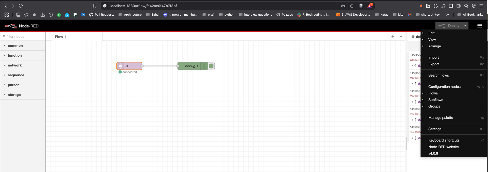
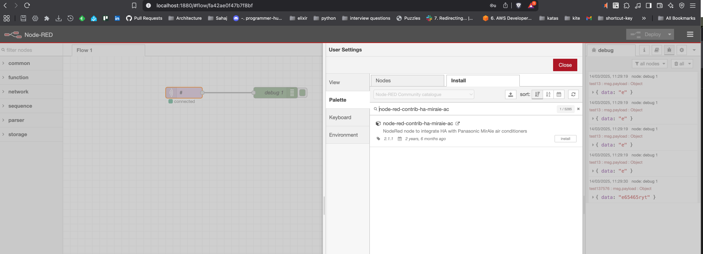
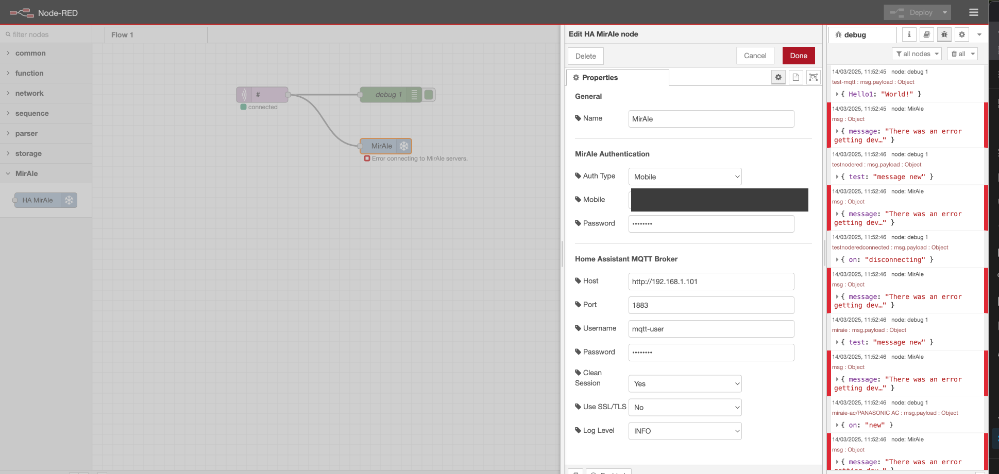

Install NodeJS:

```
# Download and install nvm:
curl -o- https://raw.githubusercontent.com/nvm-sh/nvm/v0.40.2/install.sh | bash

# in lieu of restarting the shell
\. "$HOME/.nvm/nvm.sh"

# Download and install Node.js:
nvm install 22

# Verify the Node.js version:
node -v # Should print "v22.14.0".
nvm current # Should print "v22.14.0".

# Verify npm version:
npm -v # Should print "10.9.2".

```

```
npm install -g --unsafe-perm node-red
node-red
```


This is used for Panasonic AC integration:
https://flows.nodered.org/node/node-red-contrib-ha-miraie-ac

npm install node-red-contrib-ha-miraie-ac


https://www.youtube.com/watch?v=d_G558zYm9M&t=187s


