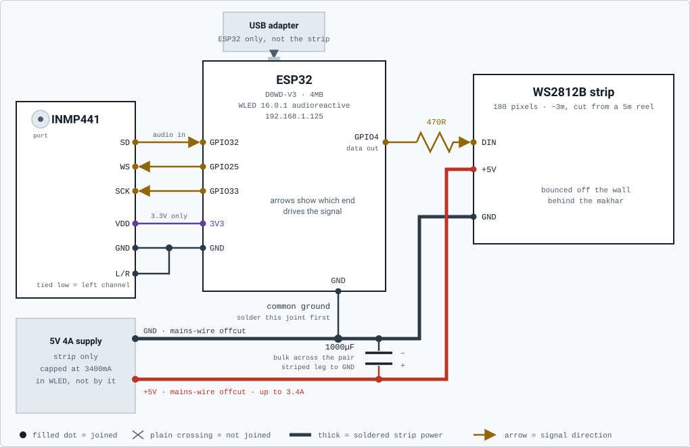

# Sound-reactive aarti lights (ESP32 + WLED + WS2812B)

A 3m strip of WS2812B behind the makhar that reacts to the aarti as it
happens - the ghanta, the claps and the singing each light the strip
differently, in real time. It is the first fully local light in the house: the
microphone, the analysis and the rendering all stay on the LAN, and nothing
about it touches a cloud.

Shipped 2026-09-12 to 2026-09-14 and running since. **This file is the
reference for what exists and how it works.** The story of how it got built,
what it cost and what was decided along the way lives in `PROJECTS.md` under
"Sound-reactive aarti lights"; the build runbook further down is kept for
re-wiring and diagnosis, not as a narrative.

## The wiring, in one picture



The same diagram with the current numbers, the mistakes that cost time on this
build and the checks that isolate each fault: [`wiring.html`](wiring.html)
(published at <https://claude.ai/artifact/9htRRMwTKPzQxMk5Fmqbmb>). Edit the
diagram there, then regenerate the inline copy with
`./projects/aarti-lights/make_wiring_svg.py`.

The inline copy is a **standalone SVG with the light-theme colours baked in as
literal hex, system fonts instead of webfonts, and an opaque panel behind the
drawing**. That is deliberate: GitHub serves SVG in markdown through an ``
tag, which blocks external CSS and webfonts and honours `prefers-color-scheme`
unreliably, so a diagram that themes itself renders as invisible text on some
backgrounds. Baking one theme in and carrying its own background means it looks
identical on a light and a dark page. Verified against `#ffffff` and GitHub's
`#0d1117`.

## Hardware

| Part | Detail |
|---|---|
| **ESP32** | D0WD-V3, 4MB. Runs **WLED 16.0.1 audioreactive**. Static **192.168.1.125** / `wled-sound.local` |
| **LED strip** | WS2812B, **180 pixels / ~3m**, cut from a locally bought 5m reel (~2m spare). Data on **GPIO4** |
| **Microphone** | **INMP441** I2S, mounted behind the makhar. `SD`=GPIO32, `WS`=GPIO25, `SCK`=GPIO33, `L/R` to GND |
| **Strip supply** | **5V 4A** (already owned), wired to the strip directly over mains-wire offcuts. WLED current cap **3400mA** |
| **Board supply** | Its own USB adapter - the ESP32 is not fed from the 5V 4A rail |
| **Passives** | **470R** in series on the data line, **1000µF** bulk across the strip's supply pair |
| **Host** | `xero` runs the renderer as a `systemd --user` service and talks to the board over the LAN |

No level shifter and no far-end power injection: both were measured as
unnecessary at 3m (see the wiring page). All-red at full brightness draws
3411mA against the 3400mA cap, and nothing runs warm.

## How it all fits together

The board does the listening and the lighting. `xero` does the thinking. They
talk over two different UDP streams in opposite directions:

```
  INMP441 ──I2S──▶ ESP32 / WLED ──GPIO4──▶ 470R ──▶ 180 WS2812B pixels
                     │      ▲
    16 FFT bins,     │      │   every pixel, 40fps
    44 frames/s      │      │   DRGB realtime UDP :21324
                     ▼      │
       multicast 239.0.0.1:11988          xero
                     └──────────▶ aarti-render.py ──┘
                                  (classify, then draw)
```

WLED analyses the audio on-board and broadcasts only its **analysis** - 16
bins of 8-bit spectral envelope, never audio. `aarti-render.py` on `xero`
classifies that into ghanta / clap / voice and draws every pixel itself,
pushing frames back over WLED's realtime protocol.

**It degrades in three tiers, and that is the whole design.** Each one works
without the ones above it:

1. **Tier 1 - WLED's own Gravimeter**, saved as boot preset 1. The strip comes
   up sound-reactive on power alone, even with `xero` down and Home Assistant
   off. This is the floor, and it is why a dead renderer is never a dark
   decoration.
2. **Tier 2 - a three-segment band split** by pitch: vocals orange, presence
   and claps green, ghanta and cymbals blue. Restored with `./wled.sh bands`.
3. **Tier 3 - `aarti-render.py`**, the default and what runs today. It
   classifies rather than splitting by pitch, because a clap and a ghanta have
   the same spectral centroid (8.72 against 8.75) and differ only in *time*.

The handover between tiers is automatic: realtime UDP carries a timeout, so if
the renderer stops, WLED reverts to its own effects a couple of seconds later
by itself.

**Home Assistant owns the schedule, not the renderer.** Four time-triggered
automations (on 08:00, off 10:00, on 17:45, off 23:00) and three dashboard
scripts live in the gitignored `HOMEASSISTANT_CONFIG/`. The renderer polls
WLED's own on/off state and stops sending while it is off - without that,
realtime UDP would override everything and the light could never be switched
off.

## The scripts, and what each one is for

| File | What it is |
|---|---|
| `aarti-render.py` | **The service.** Classifies and renders every pixel over realtime UDP. `--mode layers` (default) composites voice/clap/ghanta on the whole strip; `--mode zones` gives each a third. `--idle-timeout` controls the blackout |
| `aarti_audio.py` | **The thresholds, in one place.** Shared feature extraction and the classifier state machine. Imported by everything else - change numbers only here |
| `aarti-lights.service` | The `systemd --user` unit that runs the renderer. Waits for the board in `ExecStartPre` |
| `aarti-classify.py` | Prints classifications live **without touching the lights**. The first thing to run when the strip reacts to the wrong things |
| `aarti-sound-lab.py` | Records labelled samples into `aarti-sound/` and inspects them. How every threshold in `aarti_audio.py` was derived |
| `wled-audio-monitor.py` | Measures WLED's `sampleRaw` and suggests a squelch for the ambient it just heard. Answers "is the mic working at all" |
| `ambient-energy.py` | Measures the **total FFT energy** the classifier actually thresholds, against `FLOOR_ENERGY`. A different scale from squelch - see the Glossary |
| `wled.sh` | CLI for the board: `info`, `count`, `pin`, `cap`, `solid`, `rainbow`, `bands`, `groups`, `order` |
| `test_aarti_idle_blackout.sh` | Checks the idle blackout reaches true black and that a sound relights it. Pure maths, no hardware needed |
| `make_wiring_svg.py` | Regenerates `wiring.svg` from `wiring.html` after the diagram changes |
| `aarti-sound/*.jsonl` | The labelled recordings the thresholds come from, plus their own README |
| `wiring.html` / `wiring.svg` | The wiring diagram above, and its inline copy |

### Which one answers which question

- **"Is the mic alive?"** - `wled-audio-monitor.py`. It prints a level
  distribution and says so explicitly, because a high squelch in a quiet room
  looks exactly like dead hardware.
- **"Why is the strip lit / dark right now?"** - `ambient-energy.py` for
  whether anything is crossing the classifier's floor, then
  `journalctl --user -u aarti-lights` for what the renderer thinks.
- **"Why did it flash at the wrong moment?"** - `aarti-classify.py`, which
  shows the classification without changing the lights.
- **"The room or the bell changed."** - re-record with `aarti-sound-lab.py`
  and retune `aarti_audio.py` against the recordings. Do not re-guess the
  numbers.

## The build runbook

Everything below is how it was built, kept for re-wiring, repair and
diagnosis. The phases are in the order they were done, and each one names the
traps that cost time.

## Pin assignment (decided here so it is not re-decided at the bench)

| Signal | ESP32 pin | Why this one |
|---|---|---|
| Strip data (DIN) | **GPIO4** | free on both WROOM and WROVER modules, and not a strapping pin |
| Mic SD (data in) | **GPIO32** | mic drives this, ESP32 listens |
| Mic WS (word select) | **GPIO25** | ESP32 drives this, so it must be output-capable |
| Mic SCK (bit clock) | **GPIO33** | ESP32 drives this, so it must be output-capable |
| Mic L/R | **GND** | ties the mic to the left channel |
| Mic VDD | **3V3** | 3.3V part - never 5V |

Two constraints behind those choices, both of which bite silently:

- **Avoid the strapping pins GPIO0/2/5/12/15.** WLED's stock default data pin
  is GPIO2, which works but is a strapping pin and on many boards also drives
  the onboard LED. GPIO4 sidesteps both.
- **GPIO34-39 are input-only.** `SD` could live there, but `WS` and `SCK` are
  *driven by* the ESP32 and will simply never appear if assigned to one - a
  dead-silent mic with no error anywhere.

## Phase 0 - firmware, no hardware attached (~1h, do this first)

This is the phase that de-risks the whole project, because AudioReactive is a
*usermod* and is not in the stock WLED binary. If it flashes, the rest is
assembly. Do it before touching the strip.

**On which version to flash.** Checked against the GitHub release assets on
2026-09-12: no release after **0.14.4** publishes a prebuilt
`_ESP32_audioreactive.bin`, and install.wled.me builds its variant list from
those assets, so the "audio" option does not appear there for current
versions. That is why this runbook pinned 0.14.4 and why
`tools/esp32-tools/flash-wled-audioreactive.sh` defaults to it.

**That is a statement about the GitHub release assets, not about WLED.**
Corrected 2026-09-14: the board is now running **16.0.1 with AudioReactive** -
220 effects, and `AudioReactive`, `Audio Input Level`, `Audio Source`, `Sound
Processing`, `Manual Gain` and `UDP Sound Sync` all present. So audioreactive
builds of current WLED do exist somewhere other than the release page. The
0.14.4 pin remains the reliable path because its binary is a known URL; treat
it as a floor, not a ceiling.

Effect indices did not move between 0.14.4 and 16.0.1 - Gravimeter is 132 in
both - so presets survived the jump.

1. **Plug the ESP32 into `xero`** (rather than the MacBook) if there is a
   choice - the flash is then scriptable and its output reviewable, instead of
   a browser dialog whose result gets relayed by hand.
2. **Add the user to `dialout` once, before plugging in.** On Linux the serial
   device is `root:dialout`, and this user is not in that group by default, so
   the first flash attempt dies on permissions:
   ```
   sudo usermod -aG dialout $USER
   ```
   Then **log out and back in** (or `newgrp dialout` in the shell you will use).
   Group membership is only picked up at login, so skipping that makes the fix
   look like it did not work.
3. **Verify the board, writing nothing:**
   ```
   ./tools/esp32-tools/flash-wled-audioreactive.sh
   ```
   Read-only. It finds the port, reads the chip back, and refuses to go on if
   it is an ESP8266 or an S2/C3 variant - AudioReactive needs the original
   ESP32's I2S peripheral, and there is no audioreactive build for the others.
   It also flags a flash smaller than the 4MB WLED needs.
4. **Flash it:**
   ```
   ./tools/esp32-tools/flash-wled-audioreactive.sh --flash
   ```
   Downloads the 0.14.4 audioreactive image, erases the flash and writes it at
   `0x0`. Erasing wipes any existing WiFi credentials, which is the standard
   path for a first install. The script refuses an implausibly small download,
   because a truncated image flashes "successfully" and then bootloops.
5. **Get it on the LAN.** It comes up as the AP `WLED-AP` (password
   `wled1234`); connect and open the setup page, then enter the house WiFi
   credentials.
6. **Give it a stable address.** Set an mDNS name in WLED's WiFi settings and
   add a DHCP reservation, so the Home Assistant integration in Phase 5 does
   not lose it on a lease change.

**Resolved on 2026-09-12: it was a dead USB port on `xero`.** Three cables and
two hosts were tried before the port was; the board turned out fine
(ESP32-D0WD-V3 rev 3.1, 4MB flash) the moment it went into a port with a
proven working device in it. The lesson is step 4 below - swap into a port
something else is already using, early, because a machine with working USB
devices hands you a free control and this cost an hour without it.

### If the board does not show up at all

Run `./tools/esp32-tools/watch-usb-serial.sh` only if you are about to **replug**
something - it is a change detector and reports nothing for a board that is
already sitting in the port. For a board that is plugged in right now, check
the steady state instead:

```
ls /dev/ttyUSB* /dev/ttyACM*
lsusb -d 1a86:7523; lsusb -d 1a86:55d4   # CH340, CH9102
lsusb -d 10c4:ea60; lsusb -d 0403:6001   # CP2102, FTDI
```

Diagnosing this on 2026-09-12 cost far longer than it should have, so the
tree, in the order that actually splits the possibilities:

1. **Is a power LED lit on the board?** This is the fastest question and it
   splits the problem in half.
   - **Lit, but nothing on the USB bus** -> the cable carries VBUS and GND but
     not the D+/D- pair. A **charge-only cable**, and by a wide margin the most
     common cause. Cables bundled with power banks and wall chargers are
     frequently power-only. Swap for one that has demonstrably moved data - an
     old Android phone or Kindle cable.
   - **No LED at all** -> no power is reaching the board: dead cable, or dead
     port.
2. **Does the board even have a USB socket?** A bare ESP32-WROOM module on a
   pin-header breakout has **no USB-serial bridge at all**, so it can never
   appear on the bus no matter what cable is used. It needs an external
   USB-to-TTL adapter (CH340/CP2102, ~Rs 100-150 local) wired to TX/RX/EN/GND.
   Establish this before swapping cables, not after.
3. **Is the software side actually implicated?** Almost never - check it once
   and stop wondering. `lsmod | grep -E 'ch341|cp210x|ftdi_sio'` shows what is
   loaded, and `modinfo -n ch341 cp210x ftdi_sio` shows they are available to
   auto-load on attach. If the modules exist, a missing device is physical.
4. **Isolate the port from the cable** using a device known to work. Anything
   already enumerating (a phone, a receiver) proves its port carries both power
   and data - move the board to that port to test the port, or change only the
   cable to test the cable. One variable at a time.
5. **Still nothing? Try the MacBook** - `ls /dev/cu.*` there. The board's
   bridge either enumerates on another machine or it does not, and that single
   command separates "this machine's cable/port" from "this board is faulty"
   better than any further testing on one host.

Note that `dialout` permissions are a **later** problem than any of this: a
permission error means the device node exists. No device node at all is never
a permissions issue.

**Gate:** the AudioReactive usermod is really in the firmware. Two ways to
check, and the second is the one to trust:

- **In the browser**, the effect list shows entries marked **♪** (volume-
  reactive) or **♫** (frequency-reactive).
- **Over the API**, which is checkable from `xero`:
  ```
  curl -s http://<board>/json/info | python3 -m json.tool | grep -A3 '"u"'
  curl -s http://<board>/json/eff | grep -o -i 'gravimeter\|GEQ\|waterfall'
  ```
  `/json/info` lists `AudioReactive` under `u` when the usermod is compiled
  in, and the effect count jumps from ~118 on stock 0.14.4 to **187**.

Do **not** look for the music symbols in the API output - they are rendered
client-side by the web UI from effect metadata and are not in the JSON effect
names, so grepping for them returns zero even on a correct build. That
mistake cost a confused minute on 2026-09-12.

Note the usermod ships **disabled** - `/json/info` shows its toggle with an
`icons off` class. Enabling it is Phase 2's job, alongside the I2S pins.

**Done 2026-09-12:** WLED 0.14.4 at `192.168.1.125` (`wled-sound.local`), 187
effects. **Updated 2026-09-14 to 16.0.1 audioreactive**, 220 effects.

**What an update keeps and what it drops.** Everything in `cfg` survived: mic
pins, squelch/gain/AGC, LED pin, count, current cap, colour order, boot
preset. What did *not* survive was the **multi-segment arrangement** - the
three-band split collapsed back to one segment. Re-apply it with
`./projects/aarti-lights/wled.sh bands`.

It cannot be stored as a preset either: **WLED's preset save only captures
segment 0**, so saving the band split as a preset and recalling it restores
only the low band. The script is the way to restore it, which is why the
`bands` subcommand exists.

## Phase 1 - strip on a breadboard (~1h)

Only about **30 LEDs** get driven in this phase, and that is deliberate: a
breadboard's rails and jumper wires are good for roughly an amp, with enough
contact resistance to get warm and drop voltage well before that. Strip power
for the real build never goes through a breadboard.

5. **Leave the strip uncut and coiled.** WLED only drives as many LEDs as it
   is told, so setting a count of 30 means only 30 draw current no matter how
   long the reel is. Keep it coiled at low brightness only - a coiled reel run
   bright cooks itself.
6. **Wire it up:**
   - ESP32 from **USB** (laptop or a phone charger), strip from the **bench
     supply**. Keeping them separate means a sagging strip cannot brown out
     the ESP32, and serial stays available.
   - **Tie the grounds together: strip GND, ESP32 GND, supply GND.** This is
     the one that fails most often. Without a common ground the data line has
     no reference and you get flicker, random colours, or nothing at all -
     and it looks exactly like a broken strip.
   - **470R inline on the data line**, between GPIO4 and the strip's DIN.
   - **1000uF capacitor across the strip's power in**, observing polarity
     (the stripe is negative). Optional at 30 LEDs, but it is already bought
     and it costs nothing to have.
   - The 74AHCT125 level shifter is **not needed for this phase**. 3.3V data
     is reliable over the few centimetres of a breadboard; it earns its place
     on a 5m run.
7. **In WLED's LED settings:** length `30`, type `WS281x`, data pin `4`, and
   **max current `800mA`** - the breadboard's limit, not the supply's.
8. **Verify in this order,** because each check isolates a different fault:
   - A solid colour at low brightness → power and data are good.
   - Solid **red**, then **green**, then **blue** → if red and green come out
     swapped, the colour order is wrong (WS2812B is GRB); fix it in LED
     settings.
   - A rainbow or chase effect → **different colours at different points at
     once** is the proof the strip is genuinely addressable and every pixel is
     reachable. A strip that changes as one block here is a dumb strip, and
     the project stops until that is sorted.

**Gate:** 30 pixels, individually addressable, correct colours.

**Done 2026-09-12.** 30 pixels steady red at brightness 110, drawing 367mA of
the 800mA cap on GPIO4, colour order GRB confirmed (red renders red). Driving
it from the command line rather than the web UI: `./projects/aarti-lights/wled.sh`.

Three things cost time, all worth knowing before Phase 3 solders anything:

- **The fault was a missing common ground**, and its signature is specific:
  all 30 LEDs lit, but cycling colours continuously while WLED commanded a
  solid colour. Pixels with power and a data line but no shared voltage
  reference latch noise on every refresh, which looks exactly like a colour
  animation rather than like a wiring fault. **Solder the ground joint first
  on the perfboard and check continuity before anything else goes on.**
- **Breadboard power rails are usually split down the middle.** The two halves
  of one rail are not connected, so a ground jumper in the left half and a
  strip ground in the right half are electrically separate while looking like
  one rail. Suspect this before suspecting the strip.
- **An open WLED web UI holds a websocket and silently overwrites anything set
  over the API.** A leftover amber from the UI was briefly mistaken for a
  colour-order bug. `./projects/aarti-lights/wled.sh info` prints the client count - get it
  to 0 before trusting what the strip shows.

Also: WLED defaulted the data pin to **GPIO16**, not the GPIO4 this doc
specifies, so the pin has to be set explicitly - it is not enough to wire to
the documented pin.

**Proof of addressability, for the record:** setting the count to 5 lit exactly
five pixels and left the other 25 dark. A non-addressable strip cannot do
that, so this settles the dumb-vs-addressable question more cleanly than any
rainbow effect does.

## Phase 2 - mic on the same breadboard (~1h)

> Everything from here on uses audio vocabulary - squelch, gain, centroid,
> flatness, F0, bins. If any of it is unfamiliar or has gone stale since the
> last time this project was open, the **Glossary** at the end of this doc
> defines each one against the numbers actually measured on this board.

9. **Wire the INMP441** per the pin table above: `VDD`->3V3, `GND`->GND,
   `L/R`->GND, `SD`->GPIO32, `WS`->GPIO25, `SCK`->GPIO33. If the module
   arrived with its header pins loose in the bag, they need soldering on first
   - normal, and the iron is already on the parts list.
10. **Configure the usermod:** WLED -> Config -> Usermods -> AudioReactive.
    Set the microphone type to the generic I2S option and enter the three pin
    numbers.
11. **Check the level readout** in the usermod's section of WLED's info panel
    and clap. A number that moves means the mic works. A flat zero is almost
    always one of: `WS`/`SCK` assigned to an input-only pin (GPIO34-39), the
    mic fed 5V instead of 3.3V, or `L/R` left floating.
12. **Pick a ♪ or ♫ effect and talk at it.** This is the first moment the
    project does the thing it exists to do.

**Gate:** an audio-reactive effect visibly responds to sound. Everything
electronic is now proven, and only from here is it worth committing solder.

**Done 2026-09-13.** Mic working on SD=32, WS=25, SCK=33, `L/R` to GND. Verify
it numerically rather than by eye - `./projects/aarti-lights/wled-audio-monitor.py` reads
WLED's own analysis and prints levels plus a 16-bin FFT bar.

Four things that cost time, all avoidable next run:

- **WLED 0.14.4 does not expose the audio level over `/json/info`** - the web
  UI reads it over a websocket. The usermod *can* broadcast its analysis
  though, so enable Sync -> send and read it off the network:
  ```
  curl -X POST http://<board>/json/cfg -H 'Content-Type: application/json' \
    -d '{"um":{"AudioReactive":{"sync":{"mode":1,"port":11988}}}}'
  ```
- **That stream is multicast to 239.0.0.1, not broadcast.** Binding the port
  alone receives nothing at all, which looks exactly like a dead mic. The
  monitor script joins the group explicitly, and names the LAN interface
  because this host also has docker bridges and tailscale to choose from.
- **Changing the mic pins needs a reboot.** WLED initialises I2S at boot, so
  setting `digitalmic.pin` on a running board leaves the driver on the old
  pins. `POST /json/state {"rb":true}` or `GET /reset`, and note the uptime
  read straight afterwards can still be the pre-reboot value.
- **Squelch and gain can hide a working mic.** Diagnose with `squelch: 0`,
  `gain: 100`, `AGC: 0` so nothing is masked, then restore sane values. Left
  at gain 100 with AGC off it pegs flat at 255, which reads as broken in the
  other direction.

Settled at **squelch 10, gain 40, AGC off**. That gives sampleRaw spanning the
full 0-255 with real dynamics between, which is what a decoration wants:
silence reads dark, the crescendo fills the strip.

**AGC off is deliberate.** Automatic gain control pushes quiet passages up and
pulls loud ones down, so the lights stay equally busy through a lull and a
crescendo alike. Good for a level meter, wrong for an aarti backdrop, where
the dynamics *are* the effect.

**Do not tune against the `Audio Source ... peak NN%` field in `/json/info`.**
It is a slow-decaying peak *hold*, not a level: it ratchets upward, resets low
after a config change, and then climbs, so consecutive identical readings mean
nothing and a lower gain can appear to read higher purely because the hold had
already climbed. That cost a confusing round of gain comparisons on
2026-09-13, every one of them invalid. Use `./projects/aarti-lights/wled-audio-monitor.py`,
which reads instantaneous samples about 20x a second off the UDP stream.

And tune in the actual room, in the evening, with the actual aarti playing -
street noise alone is enough to make a bench measurement meaningless.

## Phase 3 - real power, real length (~30min)

13. **Swap to the proper supply and set WLED's max current to its actual
    rating** - `./wled.sh cap 3400` for the 5V 4A supply this build uses. The
    limiter then auto-caps brightness, which makes over-draw impossible by
    construction rather than by discipline.
    - The cap is load-bearing, not decorative. At ~55mA per LED at full white,
      180 pixels model to **9.9A** against a 4A supply. The limiter is the only
      reason that is safe.
    - What it actually draws: all-red at full brightness measured **3411mA**
      against the 3400mA cap, and nothing ran warm.
    - **A too-small supply does not announce itself.** It works, it looks dim,
      and it never tells you that is the problem - see PROJECTS.md.
14. **Set the real LED count** - `./wled.sh count 180` for the ~3m as built.
    - **No far-end power injection was needed at 3m**, and it was measured, not
      assumed. Beyond that the strip's own copper drops enough voltage that
      white drifts pink toward the far end even with an adequate supply, so a
      5m run would want 18AWG injected at both ends.
15. **Move the strip and mic off the breadboard** onto the perfboard now that
    the pinout is proven. Strip power goes supply-to-strip directly and never
    through the perfboard either - **jumper wires cap strip current at about
    1A**, which on this build made three different supplies look identically
    dim before the wiring was suspected.

## Phase 4 - mount and diffuse (2-4h, the phase that always overruns)

16. **Aim the strip at the wall behind the makhar, not at the room.** Bare
    WS2812s read as a row of dots and look cheap; the bounce is free and looks
    better than any diffuser. This is a design decision already made, not a
    preference to relitigate at 11pm.
17. **Check it in the dark, at the real position.** Nothing about how this
    looks can be judged at midday on a bench.

## Phase 5 - Home Assistant (~1h)

18. **The WLED integration auto-discovers it** - accept the discovery prompt;
    the stable address from step 4 is what keeps it found.
19. **Save presets in WLED** for the two or three looks worth having (aarti,
    ambient, off), then expose them as HA scenes so the light is reachable
    without the WLED app.

**Which light entity to target depends on how many segments the board has,**
and it changes under you. HA's WLED integration only creates the whole-device
`light.wled_main` when the strip has **more than one segment**; with a single
segment it publishes just `light.wled`, which is then the whole strip.
`light.wled_main` stays in the entity registry either way, so an automation
aimed at it does not error - it logs `Referenced entities light.wled_main are
missing or not currently available` and does nothing.

That is the reverse of the multi-segment trap below, and both have bitten this
project. While the three-segment band split was applied, `light.wled` was
segment 0 and switching it off left the other two lit. Once the board went back
to one segment, `light.wled_main` went unavailable and the aarti automations
were running on their second action alone - the `brightness_pct: 85` in the
`light.wled_main` action of the 17:45 automation is silently dropped today.
Check `/json/state` for the segment count before deciding, or target both, as
those automations do.

## Phase 6 - tune in the room, in the evening, at real volume (1-2h)

20. **Tune gain and squelch last**, in place, with the actual aarti playing at
    the volume it will really be at. The room's acoustics and real volume are
    the only settings that matter and cannot be faked earlier. Squelch sets
    the noise floor the effects ignore; gain sets how hard they swing.

**Squelch is the control that decides whether it looks reactive at all**, more
than gain. If ambient noise sits above the squelch threshold, every effect
pins at maximum and reads as *not responding* - all LEDs lit, steady, with
rare dips. That is the same appearance as a broken mic, and it is the trap to
know about: on 2026-09-13 a noisy street kept levels at 93% and made three
different effects look dead. Raising squelch from 10 to 40 dropped the
baseline to 0 between sounds, which is what the effects need.

Too high and quiet passages of the aarti vanish; too low and the room holds
the lights on. Tune it against the actual aarti, and use
`./projects/aarti-lights/wled-audio-monitor.py` rather than the web UI's peak field - you
want `sampleRaw` resting at 0 between sounds and reaching a few hundred on
the loud moments.

**Calibrate at the noisiest time of day, not the quietest.** The monitor
prints a level distribution and a suggested squelch from the ambient it just
measured, so the number it gives is only as good as the moment it was taken.
A threshold measured on a quiet night is far too low for daytime, and the
lights sit on all afternoon. Measure when the room is at its normal worst -
which for this project is the evening, when the aarti actually happens.

A useful reading from a quiet night (2026-09-14, only the white-noise machine
running): median and p90 both 0.0 at squelch 40, with p95 55, p99 199 and a
max of 215. So the floor was already suppressed 90% of the time and it was
occasional spikes punching through that lit the strip. Squelch 70 silenced
those completely - correct for that room at that hour, and certainly too deaf
for a room with people in it.

**A flat zero is not necessarily a fault.** High squelch plus a quiet room
produces exactly the same reading as a dead mic. Check the squelch value
before suspecting hardware - the monitor now says so rather than listing
hardware faults first, which it did until this was hit.

**Effects that are 2D-only fail silently on a strip**, showing a flat colour
rather than an error - GEQ, Funky Plank, Waverly, Swirl and Akemi are all
matrix-only. Of the 29 audio-reactive effects in this build, **24 work on a
1D strip**. Check before blaming the mic:
```
curl -s http://<board>/json/fxdata | python3 -c "import sys,json;print(json.load(sys.stdin)[139])"
```
A `2` in the fourth semicolon-separated field means it needs a matrix.

### The renderer has its own floor, separate from squelch

Squelch is a WLED setting and acts on `sampleRaw`, which is what the built-in
effects (Tier 1 and 2) respond to. The Tier 3 renderer does not use it: it
thresholds the **sum of the 16 FFT bins** against `FLOOR_ENERGY` in
`aarti_audio.py`. Those are different scales, so a squelch that looks right in
the WLED app says nothing about what the classifier will do. Measure that one
with `./projects/aarti-lights/ambient-energy.py`, which prints the distribution
of exactly the number the classifier compares.

A resting reading from this room (2026-09-18, 01:20, ceiling fan on): total
energy median 294, max 371 over 30s, against `FLOOR_ENERGY` 450 - not one
frame of 1318 crossed it. So the fan is **not** picked up, with reasonable
headroom.

**The strip goes dark on its own after 20s of silence** (`IDLE_TIMEOUT_S` in
`aarti-render.py`, then a 3s fade). Before that it painted `IDLE = 0.05` amber
on every pixel forever, so a silent room still showed a dim low glow - which
looks exactly like a mic picking up the fan, and was the reason the
measurement above got taken. `--idle-timeout 0` restores the always-lit
behaviour. `test_aarti_idle_blackout.sh` covers it.

It keeps **sending black frames** rather than stopping: going silent would let
WLED's realtime timeout lapse and hand the strip back to its own Gravimeter
boot preset, which is lit and sound-reactive - the opposite of off. Holding the
realtime lock with black keeps it dark and still lights it instantly on the
next sound. Note this means `sensor.wled_estimated_current` rests at ~300mA
(WLED's fixed overhead plus 180 idle LEDs), not the ~120mA of a genuinely
switched-off board.

## If you have to stop partway

WLED with no working mic is still the full addressable strip - 100+ effects,
chases, palettes, phone app, HA. **A backdrop running programmed effects is a
finished decoration**, and the mic upgrades it to reacting to the live aarti
whenever Phase 2 lands. So if something has to give, give up Phase 2 and 6,
not Phase 4 - an unmounted strip looks like a project, a mounted one looks
like a decoration. This was written against a festival deadline and it is the
right order to rebuild in anyway: get it mounted and lit, then make it
listen.


## Glossary - the audio terms this doc and the code use

Defined against this board's own measurements rather than in the abstract, so
the numbers here are the ones to expect when something is working.

### The two settings on the board

**Gain** - how much the mic signal is amplified before anything analyses it.
This board sits at `1.06x`. Turning it up enlarges the noise along with the
signal, so it does not help hear the aarti over the street.

**Squelch** - a floor. Anything quieter is forced to zero and treated as
silence. The word is from radio, where squelch mutes the hiss between
transmissions. **This is the setting that decides whether the strip looks
reactive at all** (see Phase 6): at squelch 10 street noise sat above the
floor permanently, levels read 93% constantly, and every effect pinned at
maximum looking exactly like a dead mic. At 40 the resting level fell to 0
between sounds and the effects worked.

In short: gain is the volume knob, squelch is the "ignore anything quieter
than this" line. Gain makes a quiet sound louder; squelch decides whether it
counts at all.

### Turning sound into numbers

**FFT** (Fast Fourier Transform) - the maths that takes a moment of sound and
reports how much energy sits at each frequency. Play a chord, and the FFT says
which notes are in it.

**Bins** - the FFT gives buckets, not infinite precision. This board runs a
512-point FFT at 22050Hz, so the underlying resolution is **~43Hz per
bucket** - ample to separate 110Hz from 190Hz, useless for 175 vs 200. WLED
then groups those into the **16 bins** it broadcasts, centred roughly at 64,
107, 172, 323, 495, 710, 990, 1270, 1570, 1936, 2584, 3375, 4428, 5621, 6644
and 11383Hz (`BIN_HZ` in `aarti-sound-lab.py`). The spacing is roughly
logarithmic, like hearing. They arrive as **8-bit** values, so absolute level
is already gone by the time anything here sees them.

**F0, the fundamental frequency** - the lowest frequency of a voice, heard as
its pitch. Adult male roughly 85-155Hz, adult female 165-255, a toddler
350-500.

**Harmonics** - whole-number multiples of F0: a 150Hz voice also puts energy
at 300, 450 and 600Hz. This is why "is there energy up high?" cannot by itself
identify a child's voice in a room of adults singing - their harmonics run
straight through a child's range. The test has to be high-band energy *with a
quiet low band*.

**Decay tail** - how a sound fades after it stops. The ghanta rings ~13s; a
clap is gone inside 0.5s. That gap is the most useful feature for separating
them, which is why recordings are made at **squelch 0** - a higher squelch
zeroes the quiet frames and throws the tail away.

**Far-field** - the mic is metres from the source rather than at someone's
mouth, so it collects room reverb and everything else in the room. It degrades
anything trying to recognise a voice.

### The three features the classifier actually uses

All three come out of `features()` in `aarti_audio.py`, and the labelled
figures below are from the recordings in `aarti-sound/`.

| Term | Plain meaning | Measured here |
|---|---|---|
| **Energy** | Total loudness - the 16 bins added up | Resting room 294 median (max 371); `FLOOR_ENERGY` 450; clap 2340 |
| **Spectral centroid** | The balance point of the spectrum. Low = boomy, high = bright or hissy | Voice 2.32, clap 8.72, ghanta 8.75 |
| **Spectral flatness** | Noise-like vs tone-like. Near 1 = broadband hiss, near 0 = a pure ringing tone | Ghanta 0.694 live, claps 0.839-0.887 |

Centroid is what separates voice from everything else. Flatness is what tells
the bell from the clap *early*, since their centroids are nearly identical
(8.72 vs 8.75) - a bell is a tone, a clap is a burst of noise.

**The centroid is a weighted mean bin *index*, not a frequency in Hz.** So
`VOICE_CENTROID_MAX = 4.5` means bin 4.5, somewhere around 400-500Hz. Reading
it as Hz is an easy and badly misleading mistake.

**sampleRaw / sampleSmth** - the instantaneous level and a smoothed version.
Squelch acts on `sampleRaw`. **This is a different scale from the energy
above**, and confusing the two is the trap that made the 2026-09-18 dim-glow
question hard to answer: squelch 40 and `FLOOR_ENERGY` 450 are not comparable
numbers. `wled-audio-monitor.py` measures the first, `ambient-energy.py` the
second.

**FFT_MajorPeak / FFT_Magnitude** - the single loudest frequency present, and
how strong that peak is.

### Statistics shorthand used throughout

**p90 / p95 / p99** - "90% of readings fell below this". Thresholds are set
from percentiles rather than the maximum, because one freak spike should not
define a floor. "Median 294, max 371" means a typical frame read 294 and the
worst frame in 30s read 371.

### Speaker identification (considered and closed - see PROJECTS.md)

Not used by this project. Recorded because the terms appear in the backlog
entry that evaluated giving each family member their own colour.

**VAD** (voice activity detection) - a first pass finding which chunks contain
a voice at all, so silence is not analysed.

**Embedding, or voice print** - a neural net turning a few seconds of speech
into a list of numbers (typically ~192) that captures *who* is speaking rather
than what was said. **ECAPA-TDNN** and **x-vector** are the usual networks.

**Enrollment** - recording each person once to build their reference print.

**Cosine similarity** - how two embeddings are compared: the angle between
them, 1 being identical and 0 unrelated. "Closest match" means taking the
highest.

**Open-set recognition** - deciding a voice is *nobody enrolled*, which needs
a rejection threshold calibrated with **impostor data** (recordings of
non-family). This is why a blanket "visitor" colour is harder than closest
match, not easier.

**Diarization** - working out who spoke when in a recording containing several
people, which overlapping singing would require.

**Jitter / shimmer** - small variations between one vocal cycle and the next,
in pitch and in loudness. With breathiness these carry age - and they are
exactly what 16 coarse 8-bit bins discard.

**Mel bands** - frequency bands spaced the way hearing works, fine at the
bottom and coarse at the top. Speaker ID normally wants 40-80 of them; this
stream carries 16.
